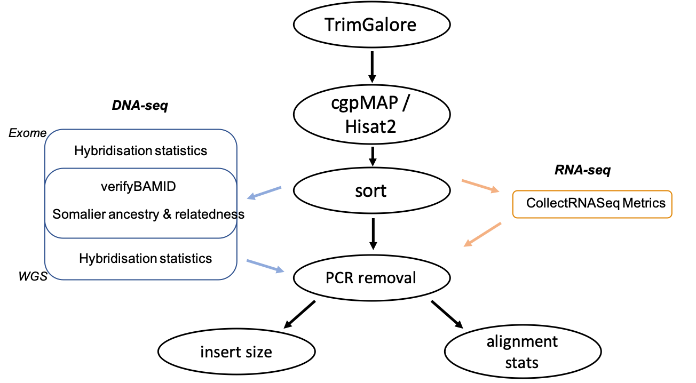

  

  

Quality control (QC) is an essential step in any NGS experiment as there a number of common sequencing artefacts such as read errors, primer/adapter contamination, PCR/optical read duplication. Failure to remove such artefacts can negatively impact upon downstream analyses and produce erroneous conclusions. The majority of these downstream analyses do not perform filtering steps or provide tools for QC, therefore these sequencing artefacts should be filtered out to prevent inaccurate results.

  

*Figure 1 - QC pipeline flowchart.*

  

We have developed pipelines that include the all the essential QC tools for both RNA and DNA (variant exome and WGS) sequencing experiments - summarised in figure 1. Irrespective of sample type, samples are first trimmed using TrimGalore, analysed by FastQC and aligned (cgpMAP and HISAT2 for DNA and RNA, respectively). The picard toolkit suite is also used to remove PCR and optical duplicates, give read insert sizes and alignment statistics. 

  

Additional tools have been included to estimate the levels of contamination (verifyBAMID), relatedness scores and ancestry estimation in DNA-seq samples (Somalier) - shown in figure 2. These analsyes allow the identification of samples that may have been mislabelled, contaminated or degraded thus preventing errouneous result interepretation. 

  

Once all analyses have been performed, multiQC is used to create QC plots reporting results in an easy and digestible format. An example of a multiQC report is [here](https://multiqc.info/examples/wgs/multiqc_report.html#qualimap). If samples pass QC, they will progress onto their chosen downstream analysis - such as the germline or somatic variant discovery pipelines.

