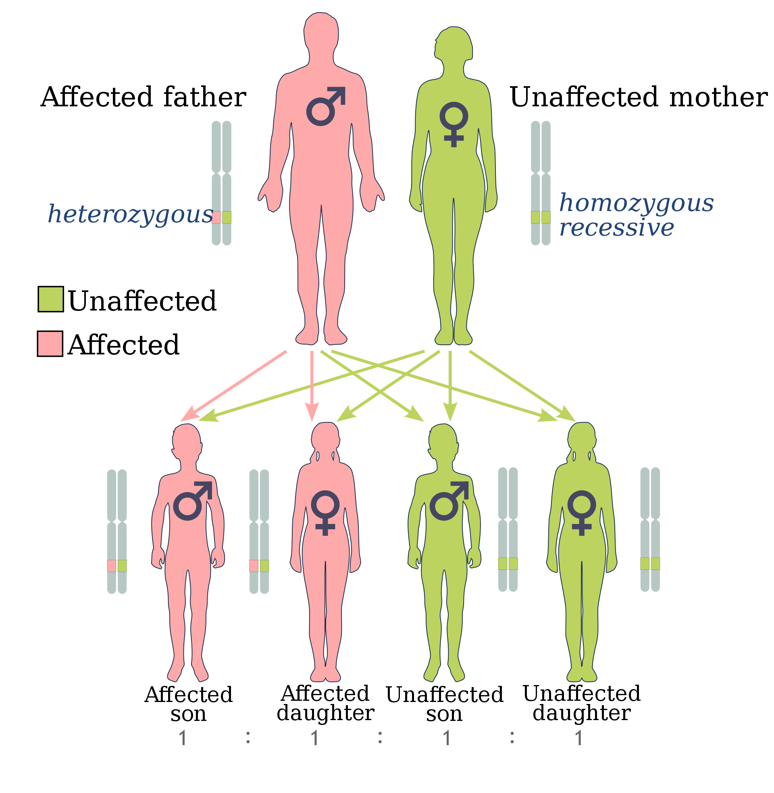
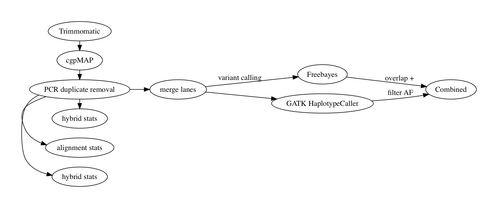

*Figure 1 - An example of inheritance of the genetically dominant BRCA mutation.*

  

A germline mutation is characterised by a change in bases that are occur within the gamete cells, thus resulting in these mutations to be present in every somatic cell of an individual. Given that germline mutagenesis is a fundamental biological process driving heritable genetic variation, identifying germline variant which attribute to a particular disease can be a challenging task. We have developed a germline variant discovery pipeline that utilises two independent variant callers; GATK Haplotype caller and Freebayes (figure 2). This pipeline accepts both exome and whole genome sequencing data, in addition to an optional pedigree (PED) file to allow overlap between disease affected/unaffected family members.

  

*Figure 2 - A flowchart depicting UEA MED genomics QC and germline pipeline.*

  

The GATK module includes all the recommended tools described from the [Germline short variant discovery (SNPs + Indels workflow)](https://gatk.broadinstitute.org/hc/en-us/articles/360035535932-Germline-short-variant-discovery-SNPs-Indels-). This module automates 11 processes including recalibration against known common variants, variant calling (HaplotypeCaller), convolutional neural network variant scoring and filtering  to produce a list of high quality variants. In contrast, our Freebayes module utilises a bayesian  approach which then filters variants based on quality scores and depth (https://github.com/ekg/freebayes).

  



*Figure 2 - an exmaple of SIFT prediction of deleteriousness for variants. Part of the germline variant pipeline.*

  

Next, variants called by GATK haplotype caller and Freebayes are overlapped and annotated using variant effect predictor (VEP). Common variants are filtered using the GnomAD database for sequencing data using user define cut off values; SIFT and PolyPhen are used to predict the deleteriousness of variant (figure 2). A user-friendly html report is created providing interactive tables and plots allowing users to interrogate the new rare-variant results - an example of this report can be found [here](https://uea-med-pipelines.netlify.app/project/cholesteatoma) in the Cholesteatoma project we have recently processed (as of Sept 2020).

  

  

