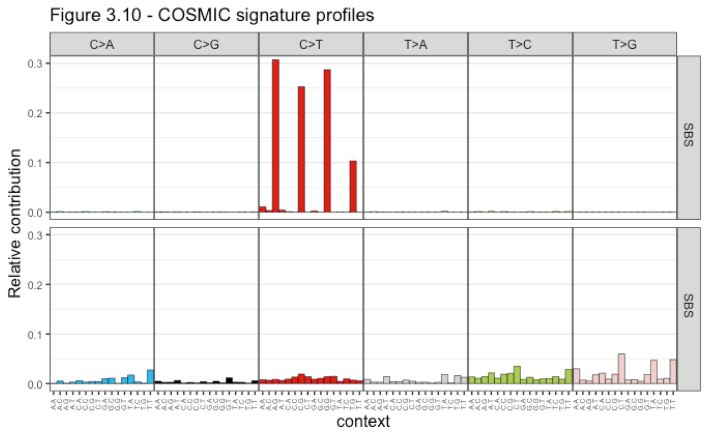

  

After samples have passed QC and have been mapped, tumor-normal matched samples can be analysed using our somatic variant pipeline - both exome and whole genome sequencing (WGS) is supported with these pipelines.. This pipeline is composed of 3 main parts; the first 2 parts analyses files using 2 independent variant callers from Sanger and GATK.  

  

The Sanger pipelines cgpWXS and cgpWGS were designed for exome and WGS, respectively (https://github.com/cancerit). Both Sanger pipelines utilise CAVeMAN and Pindel to call single base substitutions (SBSs) and insertions-deletions (indels) which are annotated by VAGrENT. CgpWGS also includes BRASS and ascatNgs for breakpoint and copy number analysis. Both tools identify high quality variants that are used downstream for further analysis.

  
 
The GATK pipeline was developed in-house and include all the reccomennded tools described in the the  [mutect2 GATK workflow](https://gatk.broadinstitute.org/hc/en-us/articles/360035889791--How-to-Call-somatic-mutations-using-GATK4-Mutect2-Deprecated-). This pipeline automates 10 processes including recalibration against known common variants, variant calling (mutect2), contamination calculation and filtering variants to produce a list of high quality variants.

  

The final part of our pipeline creates an overlap between the variants found in both Sanger and GATK variant callers. A html report is created from the results that includes annotated variants significantly different between normal and tumor samples, variant class summary (E.g. nosense, stop codon, etc) across samples, cancer drug prediction and variant allele frequencies - an example of this is shown in the colorectal cancer tumoroid project [here](put inthe hhtps when ready) 

